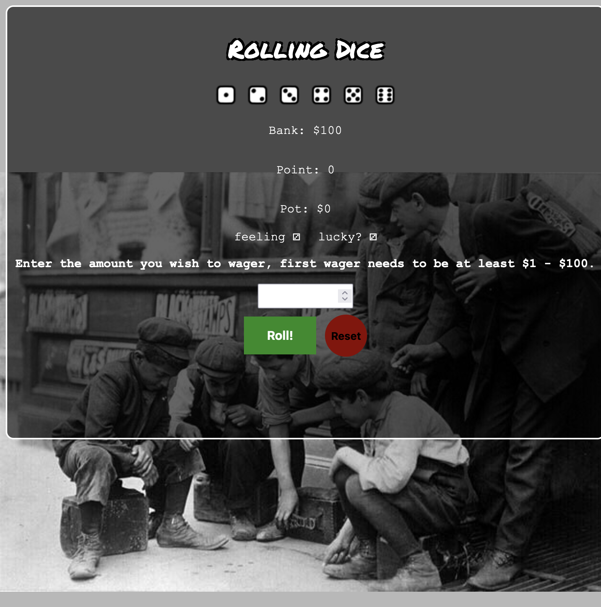
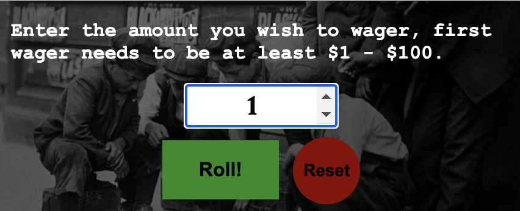
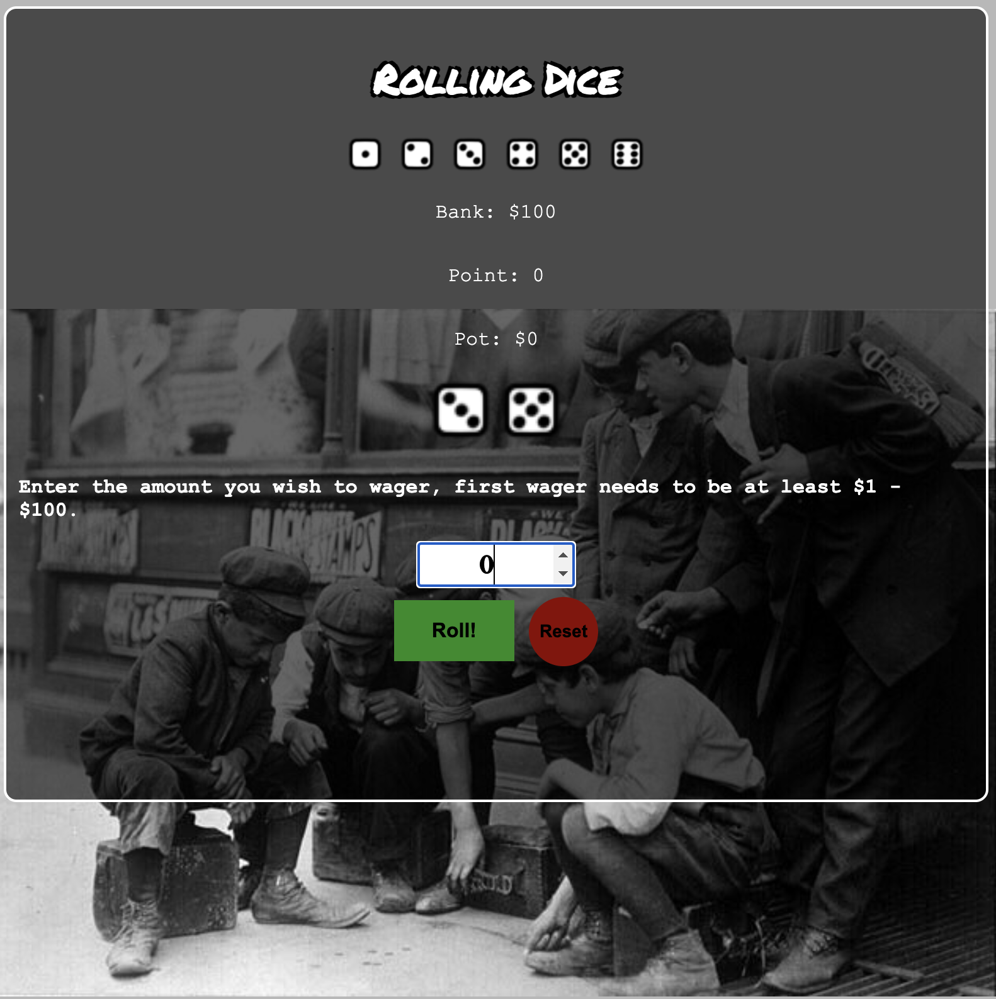
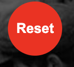
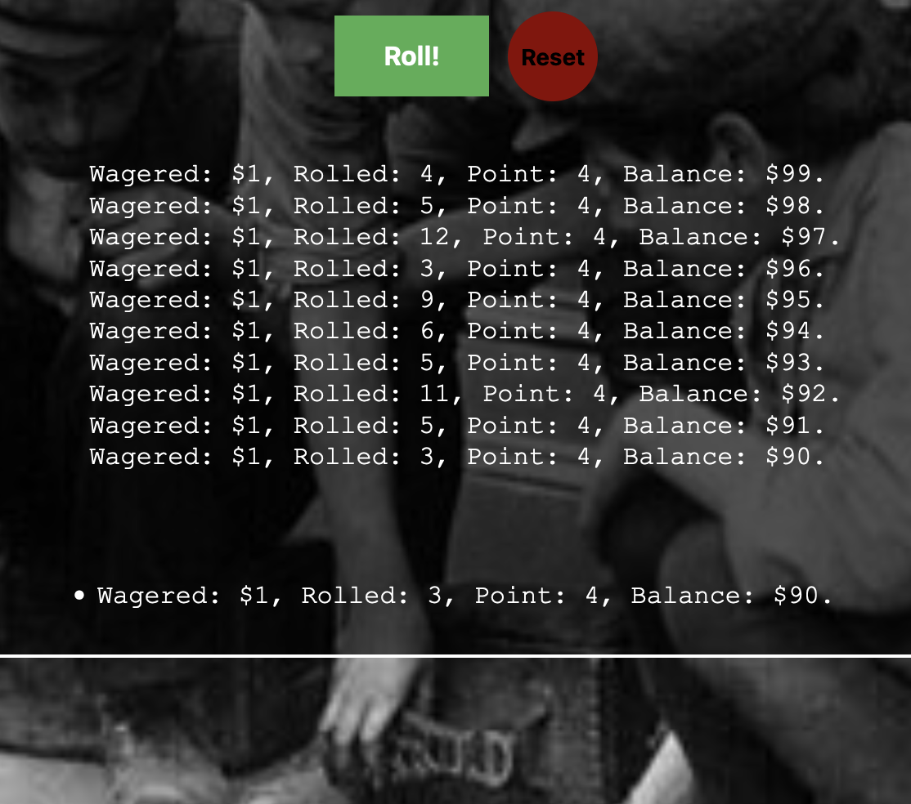

# 🎲 Rolling Dice 🎲

Welcome to **Rolling Dice**, a simple craps game where you can test your luck! Roll the dice, place your wager, and see if you can win the jackpot. 💰

## Technologies Used
- HTML: Structuring the game board and elements.
- CSS: Styling the whole page and adding animation.
- JavaScript: Implementing game logic and animations. 

## How to Play

  

1. Enter the amount you wish to wager (between $1 💵 and your bank balance). 🏦 

  

2. Click the "Roll!" button to roll the dice. 🟩 = 🎲 + 🎲

  

3. The game will evaluate the roll:
    - If the roll is 7 or 11 on the come-out, you win double the pot amount. 🎉💰💰🎊 
    - If the roll is 2, 3, or 12, you lose. 🐍 
    - Otherwise, the roll becomes the point.

  

    
4. Keep rolling until you win or lose.

5. Reset the game anytime using the "Reset" button. 🔴

  

## Getting Started
   #### 🎲  [Game Link ]<https://simon01092023.github.io/my-project/>
#### 📁 [Repo Link]<https://github.com/simon01092023/my-project>

 

  

## Next Steps: Planned Future Enhancements
- Add more animations for the dice (rolling, bouncing, etc.). 🎥 
- 🔉 🎵 Sound effects or background music for an immersive experience. 🎶

